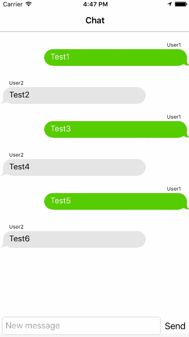

# DVChatViewController

UIViewController for simple chat.

## Installation
*DVChatViewController requires iOS 7.1 or later.*

### iOS 7

1.  Copying all the files from DVChatViewController folder into your project.
2.  Make sure that the files are added to the Target membership.

### Using [CocoaPods](http://cocoapods.org)

1.  Add the pod `DVChatViewController` to your [Podfile](http://guides.cocoapods.org/using/the-podfile.html).

        pod 'DVChatViewController', :git => 'https://github.com/denis-vashkovski/DVChatViewController.git'

2.  Run `pod install` from Terminal, then open your app's `.xcworkspace` file to launch Xcode.

## Demo

Build and run the `DVChatViewController_Example` project in Xcode to see `DVChatViewController` in action.

## Contact

Denis Vashkovski

- https://github.com/denis-vashkovski
- denis.vashkovski.vv@gmail.com

## License

This project is is available under the MIT license. See the LICENSE file for more info. Attribution by linking to the [project page](https://github.com/denis-vashkovski/DVChatViewController) is appreciated.
